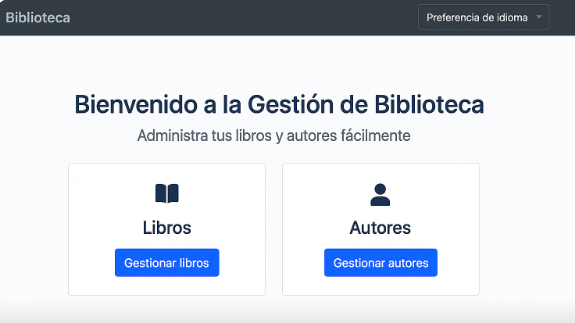

# Biblioteca JDBC



Vas a desarrollar una aplicación web que gestione el catálogo de una biblioteca: autores y libros (con fecha de publicación). 

La app permitirá listar, crear, actualizar y borrar registros.

Se proporciona el esquema de la base de datos H2 a cargar en memoria.

```
                        
                        
                        +------------------+
                        |    Book          |
+-----------+           |------------------|
|  Author   |           | id (PK)          |
|-----------|      1,n  | title            |
| id (PK)   | <-------- | author_id (FK)   |
| name      | 1,1       | publication_date |
+-----------+           +------------------+

1 libro está escrito por un único autor.
1 autor tiene uno o más libros.

```
___ 

## Funcionalidades

### Ver un listado de libros con: Título, Autor (nombre), Fecha de publicación, y acciones Editar / Borrar.

### Dar de alta en la biblioteca un libro eligiendo el autor desde un &lt;select&gt;.

### Editar un libro y actualizar sus datos.

### Borrar un libro con confirmación.

### Filtrar el listado por autor y/o por rango de años (ej.: 1960–1970).

### Ver y gestionar autores (listar/crear/editar/borrar).

### Si borro un autor, sus libros se eliminen automáticamente (comprobar ON DELETE CASCADE).

___ 

## Vistas (JSP)

### books/list.jsp

Tabla de libros con columnas: Título, Autor, Fecha, Editar, Borrar.

Botón “Filtrar” (GET).

Botón “➕ Nuevo libro” (link a /books/new).

Mensajes de éxito/error.

### books/form.jsp

Formulario reutilizable para crear/editar:

title (text, required)

authorId (select, required)

publicationDate (date, required; formato ISO yyyy-MM-dd)

Botones Guardar / Cancelar

Pre-llenar valores si es edición.

### authors/list.jsp y authors/form.jsp

___

## Validaciones y reglas en el servidor

### Book:

- title: no vacío; longitud ≤ 255.
- authorId: existente en BD (si no, error).
- publicationDate: fecha válida (yyyy-MM-dd).


### Author:
- name: no vacío; longitud ≤ 255; único (opcional, con validación en DAO).
- Mostrar errores en el formulario manteniendo lo ya introducido.
- Si algo falla en servidor, mostrar alert-danger con detalle legible

___

# OBJETIVO DEL EJERCICIO
CRUD JDBC, Servlets y JSP. No medir el domino de SQL avanzado.

## Por ejemplo: filtrado de producto por año


### Enfoque SQL simplificado
Mantiene el SQL fácil y entendible.
- Refuerza el uso de Java Streams / Optional / List filtering.
- Aísla la lógica de presentación y reutiliza el método utilitario para mostrar relaciones.
- Evita problemas de sintaxis SQL entre motores (H2, MySQL…).

**En la BD / DAO, habría consultas planas:**

```
SELECT * FROM Book;
SELECT * FROM Author;

public List<Book> findAll() {
    // devuelve todos los libros con sus author_id
}

```

**En el Servlet:**

```
List<Book> libros = daoBook.findAll();
List<Author> autores = daoAuthor.findAll();

.
.
.

String yearParam = request.getParameter("year");
if (yearParam != null && !yearParam.isBlank()) {
    int year = Integer.parseInt(yearParam);
    libros = libros.stream()
            .filter(b -> b.getPublicationDate() != null &&
                         b.getPublicationDate().getYear() == year)
            .toList();
}


```

Para mostrar el nombre del autor en la JSP:

```
<td><%= Utils.obtenerNombreAutor(autores, book.getAuthorId()) %></td>

```

### Enfoque SQL avanzado

```
SELECT b.id, b.title, b.publication_date, a.id AS author_id, a.name AS author_name
FROM Book b
LEFT JOIN Author a ON a.id = b.author_id
WHERE ( ? IS NULL OR a.id = ? )
  AND ( ? IS NULL OR EXTRACT(YEAR FROM b.publication_date) >= ? )
  AND ( ? IS NULL OR EXTRACT(YEAR FROM b.publication_date) <= ? )
ORDER BY b.publication_date DESC, b.title ASC;

```
Esto requiere una clase auxiliar DTO:

```
public class BookWithAuthor {
    private Long id;
    private String title;
    private LocalDate publicationDate;
    private Long authorId;
    private String authorName;

    // constructor completo + getters/setters
}

```

Usuaríamos en la interface GenericDAO dicho DTO:

```
public interface BookDAO extends GenericDAO<Book, Long> {
    List<BookWithAuthor> findAllWithAuthor() throws SQLException;
}

```

### Spring Data JPA / Hibernate

**Objetivo:** subir el nivel de abstracción y aprender a delegar la persistencia.

Con @Repository, @Entity, y JpaRepository, podrás:

Dejar que JPA genere el SQL por ti (sin escribir ResultSet ni PreparedStatement).

Modelar relaciones (@ManyToOne, @OneToMany) entre Book y Author.

Usar consultas automáticas:

```
List<Book> findByAuthorName(String name);
List<Book> findByPublicationDateBetween(LocalDate start, LocalDate end);

```

Y cuando haga falta, crear queries más complejas con:

```
JPQL (@Query("SELECT b FROM Book b JOIN b.author a WHERE a.name = :name"))
```

o incluso consultas nativas SQL.

___

# Añade Cookies a tu aplicación

## Cookie de idioma preferido (simulación de internacionalización)

Permitir al usuario elegir el idioma (es/en) y recordarlo:
- Al seleccionar idioma, guardas cookie lang con valor "es" o "en".
- En cada JSP, al cargar, verificas la cookie y cambias los textos de los encabezados:
```
<h2><%= lang.equals("en") ? "Library Management" : "Gestión de Biblioteca" %></h2>
```

Próximamente internacionalización (i18n) en Spring Boot...