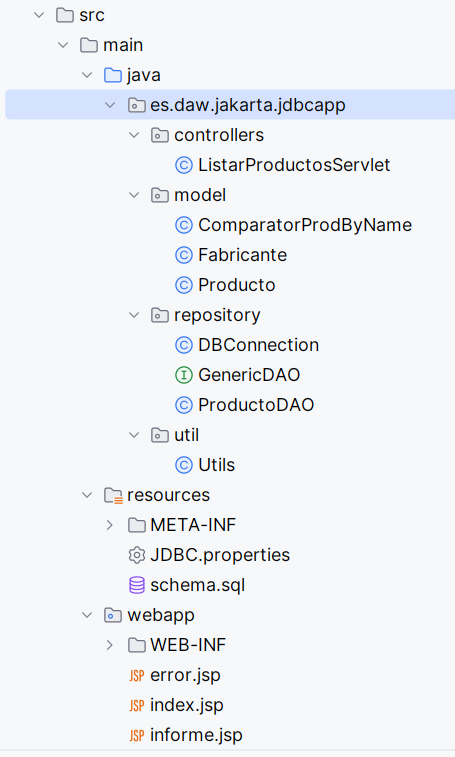
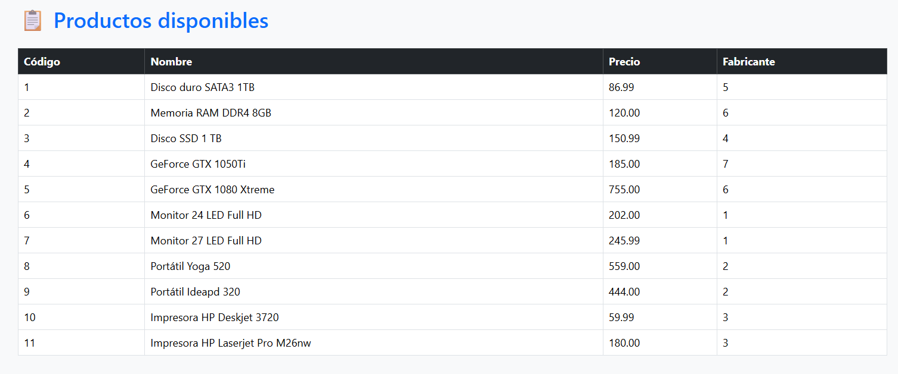
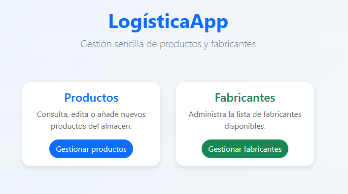

# MI PRIMER APP JDBC - PRODUCTOS

## Añadir dependencia H2 en pom.xml

Vamos a usar H2 como base de datos relacional.

```
<!-- https://mvnrepository.com/artifact/com.h2database/h2 -->
<dependency>
    <groupId>com.h2database</groupId>
    <artifactId>h2</artifactId>
    <version>2.3.232</version>
</dependency>
```

## Estructura del proyecto

Nuestro proyecto tendrá una estrucutra como la siguiente:




## H2 en memoria

La base de datos se va a crear en memoria cuando despleguemos nuestro proyecto. No existirá físicamente.

En el directorio **resources** de nuestro proyecto crearemos el archivo **JDBC.properties**:

```
# Propiedad de conexión a base de datos
#url=jdbc:h2:~/productos;AUTO_SERVER=TRUE
url=jdbc:h2:mem:productos;DB_CLOSE_DELAY=-1;INIT=RUNSCRIPT FROM 'classpath:schema.sql'
user=sa
password=

```
- mem: → le indicas a H2 que cree la BD en memoria.
- DB_CLOSE_DELAY=-1 → hace que la BD no se borre en cuanto se cierre la última conexión (muy útil en web apps).
- RUNSCRIPT FROM 'classpath:schema.sql' → ejecuta automáticamente un script SQL al levantar la conexión.
- Ese schema.sql (o import.sql) debe estar en tu classpath (por ejemplo en src/main/resources).

## Montar BD y tablas con H2 Console (si no trabajamos en memoria...)

```
java -cp h2-2.2.x.jar org.h2.tools.Server
```

El .jar lo tienes en ~/.m2/repository/com/h2database/h2/... si usas Maven, o donde lo hayas descargado.

Abre en navegador http://localhost:8082

Conecta usando:

- JDBC URL: jdbc:h2:~/productosdb;AUTO_SERVER=TRUE
- User: sa
- Password: (vacío)
- Copia y pega tu script SQL y ejecútalo (productos.sql).

Si todo va bien, deberías tener dos tablas: fabricante y producto con los inserts cargados.

El fichero productosdb.mv.db estará en tu carpeta de usuario (ej. C:\Users\tuUsuario\productosdb.mv.db o /home/tuUsuario/productosdb.mv.db).

AUTO_SERVER=TRUE → permite que distintos procesos (ej. Tomcat y H2 console) accedan al mismo fichero.

El archivo JDBC.properties contendría:


```
# Propiedad de conexión a base de datos
url=jdbc:h2:~/productosdb;AUTO_SERVER=TRUE
user=sa
password=
```


## JDBC - Trabajando con la base de datos PRODUCTOS. Práctica guiada: tienda CRUD DAO


Vamos a realizar las cuatro operaciones básicas contra una tabla usando la base de datos tienda.

[ C ] Create: daremos de alta un producto indicando todos los campos necesarios (nombre, precio, fabricante).

[ R ] Read: obtendremos el listado de todos los productos.

[ U ] Update: actualizaremos el nombre de un producto.

[ D ] Delete: borraremos un producto por id.

### Configuración de la conexión a H2

Usa la clase **DBConnection** que se proporciona.


### Servlets (Controllers)

Tendremos dos servlets o controladores:

#### 1. SERVLET ENCARGADO DE LISTAR LOS PRODUCTOS



#### 2. SERVLET ENCARGADO DE OPERACIONES DE MODIFICACIÓN (INSERT, UPDATE, DELETE) DE PRODUCTOS

   


### Vistas (JSP)

Utiliza las JSP que se proporcionan:
- index.jsp
- informe.jsp
- error.jsp

# MEJORAS

## 1. Filtrar productos por nombre
Para los alumnos...

## 2. Filtrar productos por id

Para los alumnos...

Si no existe el producto... ¿cómo lo trato? Pensar en diferentes opciones
___

## 3. Crud del fabricante

Para los alumnos.. fundamental!!!!

### 3.1. En la vista index.jsp que salga la lista de fabricantes obtenidos de la BD

Para los alumnos. 

Previamente hacer el CRUD de Fabricante por lo menos con findAll... fundamental!!!!

Esta es la lista estática a renderizar dinámicamente en el servidor:

```
        <select name="codigo_fabricante" id="departamento">
            <option value="1">Asus</option>
            <option value="2">Lenovo</option>
            <option value="3">Hewlett-Packard</option>
            <option value="4">Samsung</option>
            <option value="5">Seagate</option>
            <option value="6">Crucial</option>
            <option value="7">Gigabyte</option>
            <option value="8">Huawei</option>
            <option value="9">Xiaomi</option>
        </select>
```

**Pista:**
- El usuario pide /index en el navegador.
- IndexServlet (Servlet) hace la consulta a la BD (con tu FabricanteDAO).
- Pone la lista de fabricantes en el request.
- Hace forward a index.jsp.
- index.jsp solo muestra la vista, iterando los fabricantes recibidos.

Para que se ejecute directamente el servlet /index, tendremos que configurar en **web.xml** lo siguiente:
```
<welcome-file-list>
    <welcome-file>index</welcome-file>
</welcome-file-list>
```

### 3.2. Mostrar el nombre de fabricante, no el código, en la tabla con la lista de productos

Práctica guiada a realizar en clase.

Dos formas:
- Vista en clase con findAll.
- Usando findById por cada código de fabricante.

___

## 4. Al modificar un producto (insert, delete y update) que se muestren automáticamente la lista de productos

La lista que salga ordenada por código de producto desc....

___

# FASE II



## En la tabla con la lista de productos añadir una columna para borrar y otra para actualizar producto.


Si actualizo, saldrá un formulario con los datos del productos. Modifico las propiedades que quiero y actualizo todo el objeto producto.


Se envían de nuevo todos los datos y se genera el objeto producto.

